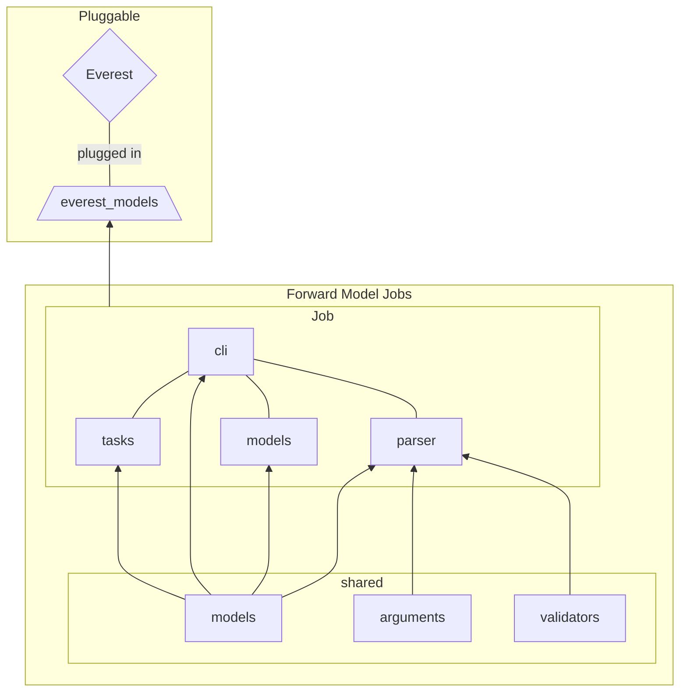

```bash
> tree -Id __pycache__ src
src
└── everest_models
    ├── forward_models
    └── jobs
        ├── fm_add_templates
        ├── fm_compute_economics
        ├── fm_drill_date_planner
        ├── fm_drill_planner
        │   ├── data
        │   ├── manager
        │   ├── models
        │   └── planner
        ├── fm_extract_summary_data
        ├── fm_interpret_well_drill
        ├── fm_npv
        ├── fm_rf
        ├── fm_schmerge
        ├── fm_select_wells
        ├── fm_stea
        ├── fm_strip_dates
        ├── fm_well_constraints
        │   └── models
        ├── fm_well_filter
        ├── fm_well_trajectory
        |   └── models
        └── shared
            └── models

26 directories
```

### Module and Directory Usage

The most alter sections of the `everest_models` project is `jobs` and `forward_models`. For adding, maintaining, or refactoring of a forward model behavior, all will need to be done within the scope of the `jobs` module. This module holds all the TNO and Equinor maintained forward models. Each forward model is prefixed with `fm_*` (forward model) key. Whenever you wish to add this job to the `everest_models` plugin, you do so by adding its calling signature to the `forward_models` directory. This directory is packaged within `everest_models` as package [data files](https://setuptools.pypa.io/en/latest/userguide/datafiles.html)

### Forward Model Job Module Layout

```bash
> tree -I __pycache__ src/everest_models/jobs/fm_well_constraints/
src/everest_models/jobs/fm_well_constraints/
├── __init__.py
├── __main__.py
├── cli.py
├── models
│   ├── __init__.py
│   ├── config.py
│   └── constraints.py
├── parser.py
└── tasks.py

1 directory, 8 files
```

A typical `fm_job` package would include the following modules: `cli`, `parser`, `tasks`, and `modules`. These modules are guidelines, in order to have a more unified structure.

#### Models

The model module holds the blueprint for all data objects that will be transacted within the job. If you have an you expecting a IO YAML and/or JSON file you can create the schema for that I/O file here within this module. There are times that the data transacted and the data input is not one in the same, Then a distinction should be made between your validation schema models and your transaction object.

Example:

wells.json is an I/O file expected to have a specific structure through out multiple jobs. (Since it's inter-job transacted object we write it's schema under the `shared` module). But the your specific Job only cares for the `ready_date` and `name` of a well. Thus it would be expensive to use `wells` pydantic object between function. It's better to have either a smaller lightweight `NameTuple` or `dataclass`. This can also live under the models module but should be distinct from the I/O validation schema

#### Parser

This module is simple and straight forward, we use this section of the package to build the argument parser for forward model job user interface. To reduce the amount of everest-models dependencies we opted to stick to with [argparse](https://docs.python.org/3/library/argparse.html), So please do the same.

> Function `build_argument_parser` must be implemented and exposed

#### Tasks

Tasks holds the core functionality/tasks of the forward model job, but this is only a guideline. You should not feel restricted by this section of the forward model module. If a `manager` and `planner`, best describes the code logic of your forward model, please by all means use it. The opposite is also true, there might not be a need for `tasks.py` since the logic is simple and can be done inline in `cli.py` .

> It is better to be readable, maintainable, and/or logical. then to adhere to bureaucracy; please use your best judgment.

```bash hl_lines="10-13 19-22 28"
> tree -I __pycache__ src/everest_models/jobs/fm_drill_planner src/everest_models/jobs/fm_well_filter
src/everest_models/jobs/fm_drill_planner
├── __init__.py
├── __main__.py
├── cli.py
├── data
│   ├── __init__.py
│   ├── _data.py
│   └── validators.py
├── manager
│   ├── __init__.py
│   ├── builder.py
│   └── field_manager.py
├── models
│   ├── __init__.py
│   ├── config.py
│   └── wells.py
├── parser.py
└── planner
    ├── __init__.py
    ├── greedy.py
    └── optimized.py
src/everest_models/jobs/fm_well_filter
├── __init__.py
├── __main__.py
├── cli.py
└── parser.py

4 directories, 20 files
```

#### CLI

This module is the forward model job's entry point. Look to the `cli.py` module as the glue that stitches all the rest of the job's modules and component together.

> Function `main_entry_point` must be implemented and exposed


#### Dunder Modules

Most may already know `__init__.py`, a file that tells the python compiler/interpreter that the following directory is a python module. As such, have this present and expose `main_entry_point` with the `__all__` global variable; it makes it easier for developers using (mypy)[https://mypy.readthedocs.io/en/stable/config_file.html?highlight=__all__#confval-implicit_reexport]

But I would also add the lesser known `__main__.py`, a file that tells the python compiler/interpreter that if the following module is inferred as script instead of a library, then run the following. This file will also defer to `main_entry_point`.

Thus the following would mostly be the same for all forward models, just make sure the imports are correct

```python hl_lines="1"
{!> ../src/everest_models/jobs/fm_npv/__init__.py!}
```

``` python hl_lines="1"
{!> ../src/everest_models/jobs/fm_npv/__main__.py!}
```


#### Compute Economics forward model vs. NPV forward model

Several economical indicators are possible either as an objective function or as optimization constraints. For example, we may want to optimize the NPV while ensuring a break-even price under a given value.

Economical indicators may share most of their features such a prices, discount rates, dates, ... and may be seen as such as several variants of the calculation of an indicator. In that respect, it was decided to extend the NPV forward model in a more general approach.

This extension allows for the implementation of future indicators by abstracting the calculator class and updates the command line inputs by gathering them all in the configuration file. As the existing NPV forward model is kept and a new module created, there is no break in compatibility.


## Plugin Flow



> This is an example for one job but there can be multiple jobs called by Everest
