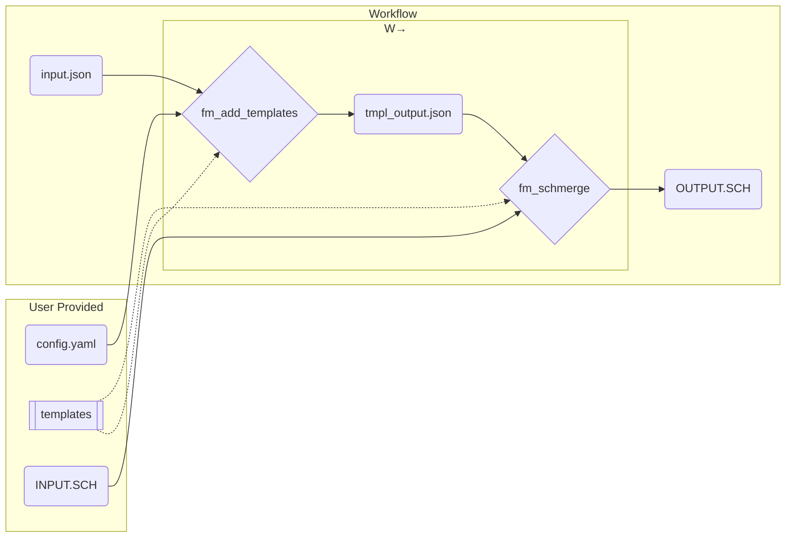

# Tokens

The goal of the tokens how-to guide is to show the flexibility of forward models.
There are some forward models that are not restricted to the scope of _.

## Workflow Example

Lets assume our example workflow (W→) [fm_add_templates] → [fm_schmerge]
is a sub workflow of a greater one.
For demonstration purposes the forward models in this W→ are invoked manually.

To run our W→ some files need to be present.
The working directory looks like the following.

```bash
❯ tree workflow
workflow
├── INPUT.SCH
├── config.yaml
├── input.json
└── templates
    ├── efac.jinja
    ├── gefac.jinja
    └── wefac.jinja

1 directory, 6 files
```

The expected behavior of W→ is to read `input.json` and `config.yaml` and create
a `template` injected copy of `input.json`.
Afterwards the copy will be passed together with `INPUT.SCH`
to create a modified copy of `INPUT.SCH`.



### File Contents

```json hl_lines="9-14 19-22 27-30"
# input.json
{!> tokens/examples/add_tmpls/input.json!}
```

As you can see in **tokens** we can fill in an arbitrary amount of key-value pairs.
Some will be read/consumed immediately in the first forward model while others
won't come into play till later.
In this example `gefac` and `wefac` are only referenced once;
by *fm_schmerge* forward model.
While the `group` and `welllist` are referenced in both
*fm_add_templates* as *fm_schmerge* forward models.

```yaml hl_lines="6-7 11 14"
# config.yaml
{!> tokens/examples/add_tmpls/config.yaml!}
```

As you can see, in the `config.yaml` used for `fm_add_templates`
we mark the keys that we wish to match with in the `input.json`

```text
--INPUT.SCH
{!> tokens/examples/schmerge/INPUT.SCH!}
```

```jinja
{# templates/efac.jinja #}
{!> tokens/examples/templates/efac.jinja!}
```

```jinja
{# templates/gefac.jinja #}
{!> tokens/examples/templates/gefac.jinja!}
```

```jinja
{# templates/wefac.jinja #}
{!> tokens/examples/templates/wefac.jinja!}
```

These [jinja] templates are used to inject formatted operations into the schedule.

### Execution

Lets manually execute the first forward model.

```bash
 ❯ fm_add_templates --input input.json --config config.yaml --output tmpl
_output.json
2023-11-24 16:11:59,793 INFO Template './templates/efac.jinja' was inserted for well 'unrelated' date '2026-11-01' operation 'efac'
2023-11-24 16:11:59,793 INFO Template './templates/wefac.jinja' was inserted for well 'unrelated' date '2025-12-01' operation 'wefac'
2023-11-24 16:11:59,793 INFO Template './templates/gefac.jinja' was inserted for well 'unrelated' date '2021-01-01' operation 'gefac'
```

```json hl_lines="9 20 29"
# tmpl_output.json
{!> tokens/examples/add_tmpls/output.json!}

```

`fm_add_templates` matched `config.yaml`'s `keys` and `input.json`'s `tokens` and
injected the `template` file path to be use at a later stage.

```bash
fm_schmerge --schedule INPUT.SCH --input tmpl_output.json --output OUTPUT.SCH
2023-11-24 15:46:05,407 INFO Inserting templates/efac.jinja with params {'name': 'unrelated', 'gefac': 0.9, 'wefac': 0.8, 'welllist': '*OP', 'group': 'OP'} at 01 NOV 2026
2023-11-24 15:46:05,410 INFO Inserting templates/wefac.jinja with params {'name': 'unrelated', 'wefac': 0.5, 'welllist': '*OP'} at 01 DEC 2023
2023-11-24 15:46:05,412 INFO Inserting templates/gefac.jinja with params {'name': 'unrelated', 'gefac': 0.23, 'group': 'OP'} at 01 JAN 2021
```

```text hl_lines="21-30 41-50 59-71"
--OUTPUT.SCH
{!> tokens/examples/schmerge/OUTPUT.SCH!}
```

`fm_schmerge` formats the jinja template with the values in `tokens` and
inject the formatted operation template into the correct schedule timeslot

Next: [Operations Rework]

[fm_add_templates]: ../reference/add_templates/reference.md
[fm_schmerge]: ../reference/schmerge/reference.md
[jinja]: https://jinja.palletsprojects.com/en/3.1.x/
[Operations Rework]: ../explanations/operations_rework.md
